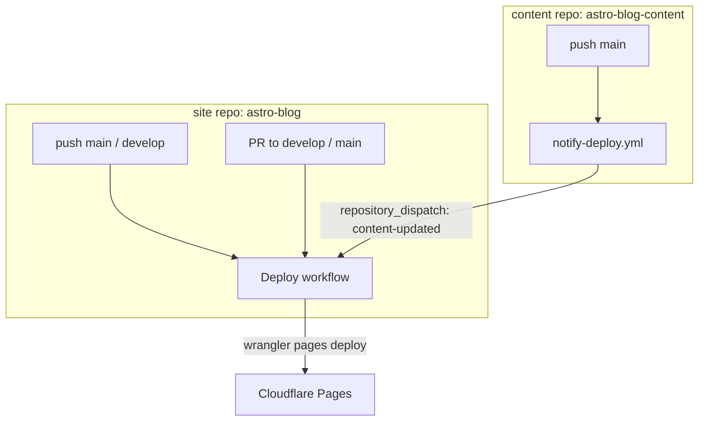

# 要件定義書: 個人事業主(SWE)向けブログ基盤

## 1. プロジェクト概要

個人事業主（ソフトウェアエンジニア）としての情報発信を目的とした技術ブログ基盤を構築する。
ソースコード自体がポートフォリオとして機能する。設計判断の過程は ADR（`docs/adr/`）に記録する。

## 2. 技術スタック

| カテゴリ | 技術 | バージョン |
|---------|------|-----------|
| フレームワーク | Astro | 6.x |
| UI ライブラリ | React | 19.x |
| Astro React統合 | @astrojs/react | 5.x |
| MDX統合 | @astrojs/mdx | 5.x |
| CSS フレームワーク | Tailwind CSS | 4.x（@tailwindcss/vite プラグイン） |
| Tailwind Typography | @tailwindcss/typography | 最新 |
| 言語 | TypeScript | 6.x |
| スキーマ検証 | Zod (astro/zod) | 4.x (Astro内蔵) |
| テストフレームワーク | Vitest | 4.x |
| Markdownプラグイン | remark-gfm | 4.x |
| 見出しID生成 | rehype-slug | 6.x |
| 見出しリンク | rehype-autolink-headings | 7.x |
| 全文検索 | Pagefind | 最新 |
| ランタイム | Node.js | >=22 |
| パッケージ管理 | pnpm | 10.x |

## 3. リポジトリ構成

### 3.1 2リポジトリ + git submodule

| リポジトリ | 公開範囲 | 内容 |
|-----------|---------|------|
| astro-blog | **public** | ブログ基盤（ソースコード、テスト、設定、ADR） |
| astro-blog-content | **private** | 記事本文、著者情報、固定ページ |

判断根拠: ADR-002, ADR-003

### 3.2 ディレクトリ構造

```
astro-blog/                    # public repo
├── content/                   ← git submodule (private repo)
│   ├── blog/                  # ブログ記事（Markdown）
│   ├── pages/                 # 固定ページ（about, services 等）
│   ├── authors/               # 著者情報（JSON）
│   └── projects/              # ポートフォリオ実績
├── content-sample/            # サンプル記事（public repo に同梱。submodule 外）
│   ├── blog/
│   └── authors/
├── src/
│   ├── content.config.ts      # Content Collections 定義
│   ├── lib/                   # 3層アーキテクチャ
│   │   ├── domain/            # 型定義・不変条件
│   │   ├── policies/          # 業務ルール
│   │   └── queries/           # データ取得・フィルタ・ソート
│   ├── pages/                 # Astro ページ
│   ├── layouts/               # レイアウト
│   └── components/            # UI コンポーネント（Astro / React）
├── tests/                     # テスト
│   ├── domain/
│   ├── policies/
│   └── queries/
├── docs/                      # ドキュメント
│   ├── adr/                   # Architecture Decision Records
│   ├── requirements.md
│   └── feasibility.md
├── astro.config.ts
├── package.json               # 単一パッケージ（pnpm workspace 不使用）
├── vitest.config.ts
└── tsconfig.json
```

## 4. 3層アーキテクチャ

DDD の思考を残しつつ、個人ブログのスケールに合わせて縮約した構成。

判断根拠: ADR-001

### 4.1 レイヤー構成

```
pages/layouts/components → lib/queries/ → lib/policies/ → lib/domain/
                           (Astro API依存)   (純粋関数)      (純粋型)
```

| レイヤー | 責務 | 外部依存 |
|---------|------|---------|
| lib/domain/ | 型定義（Post, Tag 等）、不変条件（slug 一意性等） | なし（純粋 TS） |
| lib/policies/ | 業務ルール（公開判定、日付計算等） | なし（純粋関数） |
| lib/queries/ | データ取得、フィルタ、ソート、集計 | Astro Content Collections API |
| pages/layouts/components | UI、ルーティング | Astro, React |

### 4.2 主要な関数

| 関数 | レイヤー | 責務 |
|------|---------|------|
| `isPublished(publishedAt, draft)` | policies | 公開判定 |
| `estimateReadingTime(content)` | policies | 読了時間推定（日本語: 約500文字/分） |
| `findRelatedPosts(post, allPosts)` | policies | タグ重複度に基づく関連記事推薦 |
| `sortByPublishedDesc(posts)` | queries | 日付降順ソート |
| `filterByTag(posts, tag)` | queries | タグフィルタ |
| `filterByCategory(posts, category)` | queries | カテゴリフィルタ |
| `assertUniqueSlugs(slugs)` | domain | slug 一意性検証 |
| `listPublishedPosts()` | queries | 公開済み記事一覧取得 |
| `getPostBySlug(slug)` | queries | スラッグ指定記事取得 |
| `getAllTags()` | queries | 全タグ一覧（件数付き） |
| `getAllCategories()` | queries | 全カテゴリ一覧（件数付き） |

## 5. コンテンツ仕様

### 5.1 Frontmatter スキーマ

#### blog コレクション

```yaml
---
title: "記事タイトル"            # 必須: string
description: "記事の説明"        # 必須: string
publishedAt: 2026-04-11         # 必須: date（タイムゾーン: Asia/Tokyo で判定）
updatedAt: 2026-04-12           # 任意: date（本文変更時のみ更新）
tags: ["astro", "typescript"]   # 必須: string[]（小文字正規化、URL slug は自動生成）
category: "技術"                # 必須: string（URL slug は自動生成）
author: "kyosuke"               # 必須: string (authors ID)
draft: false                    # 任意: boolean (default: false)
heroImage: "./images/hero.jpg"  # 任意: string
---
```

#### pages コレクション

```yaml
---
title: "自己紹介"               # 必須: string
description: "ページの説明"      # 必須: string
order: 1                        # 任意: number（メニュー表示順）
---
```

#### authors コレクション（JSON）

```json
{
  "id": "kyosuke",
  "name": "Kyosuke Kato",
  "bio": "Software Engineer",
  "avatarUrl": "/images/avatar.jpg",
  "social": {
    "github": "kyosuke-kato",
    "twitter": "kyosuke_kato",
    "website": "https://example.com"
  }
}
```

- `id`: 必須。blog の `author` フィールドから参照される一意キー
- `name`: 必須
- `bio`, `avatarUrl`, `social`: 任意

#### projects コレクション

```yaml
---
title: "プロジェクト名"          # 必須: string
description: "プロジェクトの説明"  # 必須: string
url: "https://example.com"      # 任意: string (URL)
tech: ["Astro", "TypeScript"]   # 必須: string[]（使用技術）
period: "2025-01 ~ 2026-03"    # 必須: string（実施期間）
order: 1                        # 任意: number（表示順）
heroImage: "./images/hero.jpg"  # 任意: string
---
```

### 5.2 タグ・カテゴリの正規化ルール

タグとカテゴリは**表示名**と **URL slug** を分離する。

| 処理 | ルール |
|------|--------|
| 正規化 | NFC 正規化 → lowercase → 全角英数を半角に |
| slug 生成 | 正規化後の値をそのまま URL エンコード（日本語タグはそのまま保持） |
| 一意性判定 | 正規化後の値で比較。`TypeScript` と `typescript` は同一タグ |
| 表示名 | Frontmatter に記載された最初の出現をマスターとして使用 |

### 5.3 公開判定とタイムゾーン

- 公開判定は `isPublished(publishedAt, draft)` predicate で**全出力先を統一**する
- タイムゾーンは **`Asia/Tokyo` (JST)** を基準とする
- 以下の全てに同一の predicate を適用:
  - ページ生成（SSG）
  - RSS フィード
  - サイトマップ
  - Pagefind 検索インデックス
  - 関連記事の候補対象

### 5.4 Markdown サポート

GitHub Flavored Markdown (GFM) の全機能をサポート:

| 機能 | 対応方法 |
|------|---------|
| テーブル / タスクリスト / 取り消し線 / オートリンク / 脚注 | GFM デフォルト (Astro 内蔵) |
| コードブロック構文ハイライト | Shiki 4 (Astro 6 内蔵) |
| 見出しアンカーリンク | rehype-slug + rehype-autolink-headings |

### 5.3 コンテンツ種別

| コレクション | 用途 | 追加時の影響範囲 |
|-------------|------|----------------|
| blog | ブログ記事 | 初期実装 |
| pages | 固定ページ（about, services 等） | content.config.ts + queries/ + ページ .astro |
| authors | 著者情報 | 初期実装 |
| projects | ポートフォリオ実績 | content.config.ts + queries/ + ページ .astro |

新しいコンテンツ種別の追加は、既存コードに影響せず局所的な変更で完結する。

## 6. 機能一覧

### 6.1 ページ・画面

| # | 機能 | パス | 説明 |
|---|------|------|------|
| F-01 | トップページ | `/` | 最新記事一覧 |
| F-02 | ブログ記事一覧 | `/blog/`, `/blog/page/[n]/` | 全公開記事の一覧（ページネーション: 10件/ページ） |
| F-03 | ブログ記事詳細 | `/blog/[slug]/` | Markdown レンダリング、メタ情報、目次、読了時間、関連記事 |
| F-04 | タグ一覧 | `/tags/` | 全タグと記事件数 |
| F-05 | タグ別記事一覧 | `/tags/[tag]/` | 指定タグの記事一覧 |
| F-06 | カテゴリ一覧 | `/categories/` | 全カテゴリと記事件数 |
| F-07 | カテゴリ別記事一覧 | `/categories/[category]/` | 指定カテゴリの記事一覧 |
| F-08 | 自己紹介 | `/about/` | 固定ページ（Markdown） |
| F-09 | ポートフォリオ | `/projects/` | 実績一覧（技術スタック、期間等） |

### 6.2 コンテンツ管理

| # | 機能 | 説明 |
|---|------|------|
| F-10 | Frontmatter バリデーション | Zod スキーマによるビルド時検証 |
| F-11 | 下書き管理 | `draft: true` で非公開。ビルド成果物に含めない |
| F-12 | 予約投稿 | `publishedAt` が未来日付の記事を非公開 |
| F-13 | GFM レンダリング | テーブル、タスクリスト、取り消し線、脚注、オートリンク |
| F-14 | コード構文ハイライト | Shiki 4 による言語別ハイライト |
| F-15 | 見出しアンカーリンク | 自動 ID 生成 + リンク付与（日本語対応） |
| F-16 | 複数コンテンツ種別 | blog, pages, authors, projects を独立コレクションで管理 |
| F-17 | slug 一意性検証 | ビルド時に重複スラッグを検出してエラー |

### 6.3 記事詳細の付加機能

| # | 機能 | 説明 | 実装方針 |
|---|------|------|---------|
| F-18 | 記事内目次（ToC） | 見出し構造から自動生成。現在位置ハイライト | Astro の `headings` + React コンポーネント（`client:idle`） |
| F-19 | 読了時間表示 | 文字数ベースの推定（日本語: 約500文字/分） | policies/ に `estimateReadingTime` を実装 |
| F-20 | 関連記事表示 | タグ重複度に基づく推薦（最大5件） | policies/ に `findRelatedPosts` を実装 |

#### F-20 関連記事アルゴリズム詳細

- スコア: 共通タグ数（多いほど関連度が高い）
- 同点時 tie-breaker: 公開日降順 → slug 昇順
- 自己排除: 現在の記事は候補から除外
- タグなし時フォールバック: 同一カテゴリの最新記事を表示

### 6.4 サイト横断機能

| # | 機能 | 説明 | 実装方針 |
|---|------|------|---------|
| F-21 | 全文検索 | 静的サイト上での記事検索 | [Pagefind](https://pagefind.app/)（ビルド後にインデックス自動生成） |
| F-22 | ダークモード | ライト/ダーク切替。OS 設定に追従 + 手動トグル | CSS カスタムプロパティ + `<head>` インラインスクリプトで初期テーマ先適用（FOUC 防止）+ React トグル（`client:load`） |

### 6.5 ページネーション仕様

| 項目 | 仕様 |
|------|------|
| 1ページあたり件数 | 10件 |
| URL形式 | `/blog/` (1ページ目), `/blog/page/2/`, `/blog/page/3/`, ... |
| SEO | `<link rel="canonical">`, `<link rel="prev">`, `<link rel="next">` を出力 |
| 適用ページ | `/blog/`, `/tags/[tag]/`, `/categories/[category]/` |

### 6.6 SEO・メタ情報

| # | 機能 | 説明 |
|---|------|------|
| F-23 | メタタグ生成 | title, description をページごとに設定 |
| F-24 | OGP タグ | Open Graph Protocol（SNS シェア用） |
| F-25 | サイトマップ | `sitemap.xml` 自動生成（`isPublished` で公開記事のみ） |
| F-26 | RSS フィード | ブログ記事のフィード配信（`isPublished` で公開記事のみ） |

### 6.7 非機能

| # | 機能 | 説明 |
|---|------|------|
| F-27 | SSG（静的サイト生成） | Astro の Static モードでビルド |
| F-28 | レスポンシブデザイン | モバイルファースト |
| F-29 | アクセシビリティ | セマンティック HTML、キーボードナビゲーション |
| F-30 | Lighthouse 90+ | パフォーマンス・a11y・SEO・ベストプラクティス全カテゴリ |

### 6.8 将来検討（スコープ外）

| 機能 | 備考 |
|------|------|
| シェアボタン（SNS 連携） | 必要になった時点で追加 |

## 7. テスト戦略

### 7.1 重点化されたテスト対象

**必須**（壊れると価値が下がるロジック）:

| テスト対象 | レイヤー | 重要度 |
|-----------|---------|--------|
| `isPublished` — draft フラグ + 未来日付 | policies | 必須 |
| `estimateReadingTime` — 日本語/英語混在、空文字 | policies | 必須 |
| `findRelatedPosts` — タグ重複度ソート、自己排除、最大件数 | policies | 必須 |
| `sortByPublishedDesc` — 日付ソート（タイムゾーン・同時刻境界含む） | queries | 必須 |
| `filterByTag` / `filterByCategory` | queries | 必須 |
| `getAllTags` / `getAllCategories` — 件数集計 | queries | 必須 |
| `assertUniqueSlugs` — slug 一意性 | domain | 必須 |

**任意**:
- 単純な型マッピング
- Zod スキーマバリデーション（ビルド時に Astro が検証する）

### 7.2 ビルド後スモークテスト（CI）

ビルド成果物（`dist/`）に対して以下を検証する:

| 検証対象 | チェック内容 |
|---------|------------|
| HTML 生成 | 主要ページ（`/`, `/blog/`, `/about/`）の `index.html` が存在すること |
| RSS フィード | `rss.xml` が存在し、`<item>` を含むこと。draft 記事が混入していないこと |
| サイトマップ | `sitemap.xml` が存在し、draft 記事の URL が含まれていないこと |
| OGP タグ | 記事ページの HTML に `og:title`, `og:description` が含まれること |
| ダークモード | `<head>` 内にテーマ初期化スクリプトが存在すること |
| Pagefind | 検索インデックスが生成されていること。draft 記事が索引に含まれていないこと |

### 7.3 品質ゲート

| 段階 | 実行内容 | タイミング |
|------|---------|-----------|
| ローカル | `pnpm check` | コード変更時（高速フィードバック） |
| CI | `pnpm check && pnpm test && pnpm build` | PR / リリース時 |

## 8. ビルド・デプロイ

### 8.1 概要

| 項目 | 方針 |
|------|------|
| ビルドモード | Static (SSG) — 静的サイト生成 |
| デプロイ先 | **Cloudflare Pages**（Astro 6 が Cloudflare 傘下であり親和性が高い） |
| CI/CD | GitHub Actions → Cloudflare Pages |

### 8.2 環境構成

| 環境 | ブランチ | URL | 用途 |
|------|---------|-----|------|
| **prod** | `main` | `https://<custom-domain>` | 本番公開サイト |
| **dev** | `develop` / PR | `https://<hash>.<project>.pages.dev` | プレビュー・動作確認 |

デプロイは **GitHub Actions からの `wrangler pages deploy` に一本化**する。
Cloudflare 側の Git 連携自動デプロイは**無効化**し、二重ビルドを防止する。

- `main` への push → GitHub Actions → prod にデプロイ
- `develop` への push / PR 作成 → GitHub Actions → プレビュー URL にデプロイ

### 8.3 環境別の振る舞い

| 項目 | prod | dev |
|------|------|-----|
| draft 記事 | **非表示**（`isPublished` で除外） | **表示**（確認用。視覚的に draft バッジを付与） |
| 予約投稿（未来日付） | **非表示** | **表示**（確認用） |
| Pagefind 索引 | 公開記事のみ | 全記事 |
| robots.txt | `Allow: /` | `Disallow: /`（検索エンジンに索引させない） |
| OGP / メタタグ | 本番 URL | プレビュー URL |
| Analytics | 有効（将来導入時） | 無効 |

環境判定は Cloudflare Pages の環境変数で**明示的に**行う:

```typescript
// src/lib/policies/env.ts
export const isDev = import.meta.env.PUBLIC_APP_ENV !== "production";
```

Cloudflare Pages の環境変数設定:
- **Production**: `PUBLIC_APP_ENV=production`
- **Preview**: `PUBLIC_APP_ENV=preview`

`CF_PAGES_BRANCH` は補助情報として利用可。`PUBLIC_APP_ENV` がない環境（ローカル等）は dev 扱いとする。

### 8.4 ブランチ戦略

```
main          ← prod デプロイ対象
  └── develop ← dev デプロイ対象。feature ブランチのマージ先
       ├── feature/xxx
       ├── fix/xxx
       └── docs/xxx
```

- `feature/*` → `develop` に PR → プレビュー確認 → マージ
- `develop` → `main` に PR → prod デプロイ
- hotfix は `main` に直接 PR してもよい

### 8.5 CI/CD パイプライン

site repo の push/PR に加え、**content repo 側の push** でも本番デプロイが走る（Option B'）。これにより記事執筆者は content に push するだけで本番反映まで完結する。



```
site repo の Deploy ワークフロー
  ├─ checkout site            # GITHUB_TOKEN
  ├─ submodule update --remote # content main の HEAD を取得（pointer に追従しない）
  ├─ content HEAD メタデータ抽出 # hash / short / message
  ├─ pnpm install / check / test / build
  └─ wrangler pages deploy --commit-hash=<content HEAD> --commit-message=<content HEAD message>
```

#### 発火条件

| トリガ | 契機 | site branch（ref） | 用途 |
|-------|------|------------------|------|
| `push: main` | site repo の main 更新 | main → production | コード / 設定変更の本番反映 |
| `push: develop` | site repo の develop 更新 | develop → preview | プレビュー |
| `repository_dispatch: content-updated` | content repo main 更新 | main（default branch）→ production | 記事の本番反映 |
| `workflow_dispatch` | 手動 | 任意 | ロールバック（§8.8） |

#### CI 最適化

| 項目 | 設定 |
|------|------|
| concurrency | ブランチ単位で古い実行をキャンセル |
| pnpm キャッシュ | `actions/setup-node` + pnpm store cache |
| ビルド成果物再利用 | build は1回。smoke test と deploy は同じ `dist/` を使用 |

#### submodule 取得

```yaml
- name: Checkout content submodule (remote HEAD)
  run: |
    git config --global url."https://x-access-token:${{ secrets.CONTENT_PAT }}@github.com/".insteadOf "git@github.com:"
    git submodule update --init --remote --recursive
```

- `GITHUB_TOKEN` は同リポのみ有効なため、private submodule には**読み取り専用 PAT**（`CONTENT_PAT`）が必要
- `--remote` により `.gitmodules` の `branch = main` に追従（site repo 側では pointer 更新を行わない）
- site repo の submodule pointer は実質参考値。実際にビルドされた content commit は Cloudflare Pages のデプロイ履歴（`--commit-hash`）で追跡する

#### PAT 一覧

| Secret | 保存先 | 権限 | 用途 |
|--------|--------|------|------|
| `CONTENT_PAT` | site repo | content repo `Contents: Read` | submodule 取得 |
| `DEPLOY_DISPATCH_PAT` | content repo | site repo `Actions: Read and write` | repository_dispatch 送信 |
| `CLOUDFLARE_API_TOKEN` / `CLOUDFLARE_ACCOUNT_ID` | site repo | Cloudflare Pages edit | wrangler deploy |

### 8.6 Cloudflare Pages 設定

| 項目 | 設定 |
|------|------|
| Git 連携自動デプロイ | **無効**（GitHub Actions から `wrangler` で統一） |
| Branch deployment controls | Custom: `main`(production) + `develop`(preview) |
| Build watch paths | 不使用（GitHub Actions 側で制御） |
| Node.js バージョン | `NODE_VERSION=22`（ローカル・CI と統一） |

### 8.7 Cloudflare Pages Free tier 制限

| 項目 | 制限 |
|------|------|
| ビルド数 | 500回/月 |
| ビルドタイムアウト | 20分 |
| ファイル数 | 20,000 |
| 単一ファイルサイズ | 25 MiB |
| 帯域幅 | 無制限 |

ビルド数節約のため、concurrency キャンセル・Build watch paths・成果物再利用を適用する。

### 8.8 ロールバック

- Cloudflare Pages ダッシュボードから過去のデプロイを即座に再公開可能
- GitHub Actions の手動トリガー（`workflow_dispatch`）で任意の commit を再デプロイ可能

## 9. 非機能要件

| 項目 | 要件 |
|------|------|
| パフォーマンス | Lighthouse スコア 90+ (全カテゴリ) |
| アクセシビリティ | セマンティック HTML、キーボードナビゲーション |
| SEO | メタタグ、OGP、サイトマップ、RSS フィード |
| レスポンシブ | モバイルファースト |

### 9.1 Lighthouse 計測条件

| 項目 | 値 |
|------|-----|
| 対象ページ | `/`, `/blog/`, `/blog/[任意の記事]`, `/about/` |
| 実行回数 | 3回（median を採用） |
| 閾値 | Performance: 90, Accessibility: 90, Best Practices: 90, SEO: 90 |
| CI 失敗条件 | いずれかのカテゴリで median が閾値を下回った場合 |
| ツール | Lighthouse CI (LHCI) |
