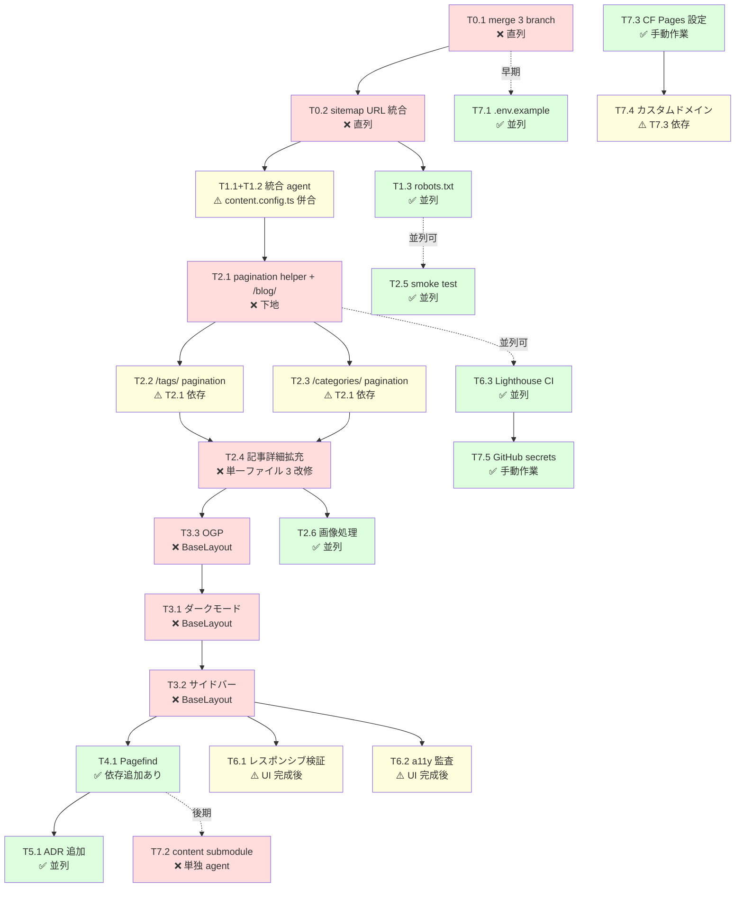

# 開発タスク一覧

未完了の実装タスクを、並列化判断付きで一覧化する。並列／直列の判断基準は `docs/notes/claude-code-worktree-parallel-dev.md` §9 を参照（※ `docs/notes/` はローカル専用で非コミット）。

## 記法

### 並列判定記号

| 記号 | 意味 |
|:---:|------|
| ✅ | 並列実行可（他タスクとファイル・依存・情報すべて独立） |
| ⚠️ | 条件付き並列（同じファイルに触れる可能性等で調整が必要） |
| ❌ | 直列必須（同一ファイル編集・依存重複・情報依存） |

### F/D/I 軸

- **F (File)**: 同じファイルを編集するか
- **D (Dependency)**: パッケージ追加を伴うか
- **I (Information)**: 他タスクの成果物を参照するか

---

## 現在地（2026-04-18 時点）

### 完了済み（main に merge 済み）

- Astro 6 初期セットアップ + 3 層アーキテクチャ（`62a06ee`）
- ルーティング: `/`, `/blog/`, `/blog/[...slug]/`
- MDX サポート、GP 風デザイン
- 38 tests pass、5 pages 生成

### 実装済み・未 merge（agent branch）

| ブランチ | 内容 |
|---------|------|
| `worktree-agent-aa48d24e` | F-04〜F-07 タグ/カテゴリページ（`/tags/*`, `/categories/*`） |
| `worktree-agent-a2d80006` | F-25, F-26 sitemap/RSS（`@astrojs/rss` 依存追加、`package.json` 変更あり） |
| `worktree-agent-a746d5af` | GitHub Actions（CI + Cloudflare Pages deploy） |

`develop` への merge と、sitemap への tags/categories URL 統合がフェーズ 0 の下地作業となる。

---

## フェーズ 0: 下地作業（直列必須）

merge 順序の調整と統合修正。

| ID | タスク | 並列判定 | F | D | I | 備考 |
|----|--------|:---:|:-:|:-:|:-:|------|
| T0.1 | agent 3 branch を develop に merge | ❌ | ✓ |   |   | sitemap-rss の lockfile を最初に取り込むと後続の依存整合が楽 ✓ 2026-04-18 |
| T0.2 | sitemap に `/tags/*`, `/categories/*` URL を追記 | ❌ |   |   | ✓ | T0.1 完了後に実施 ✓ 2026-04-18 |

**推奨 merge 順**: `worktree-agent-a2d80006`（lockfile） → `worktree-agent-aa48d24e`（ページ群） → `worktree-agent-a746d5af`（CI）

---

## フェーズ 1: 独立ページ追加

| ID | タスク | 並列判定 | F | D | I | 備考 |
|----|--------|:---:|:-:|:-:|:-:|------|
| T1.1 | `/about/` 固定ページ（pages コレクション） | ⚠️ | ✓ |   |   | `src/content.config.ts` を触る ✓ 2026-04-18 |
| T1.2 | `/projects/` 固定ページ（projects コレクション） | ⚠️ | ✓ |   |   | 同上。新規 frontmatter スキーマ追加 ✓ 2026-04-18 |
| T1.3 | `robots.txt.ts`（環境別 Allow/Disallow） | ✅ |   |   |   | `src/pages/robots.txt.ts` 新規のみ ✓ 2026-04-18 |

**並列化方針**: T1.1 と T1.2 は `content.config.ts` で F 衝突 → **1 agent に統合**。T1.3 はそれと並列可。
**推奨**: 2 agent 並列（「T1.1+T1.2 統合」と「T1.3」）。

---

## フェーズ 2: 機能追加

| ID | タスク | 並列判定 | F | D | I | 備考 |
|----|--------|:---:|:-:|:-:|:-:|------|
| T2.1 | ページネーション 共通ヘルパー + `/blog/page/[n]/` | ❌ |   |   |   | `lib/policies/pagination.ts` + `Pagination.astro`（basePath で汎用化）+ 14 tests ✓ 2026-04-18 |
| T2.2 | `/tags/[tag]/page/[n]/` | ⚠️ |   |   | ✓ | T2.1 の `Pagination.astro` / `paginate` を再利用。日本語タグも自動エンコード ✓ 2026-04-18 |
| T2.3 | `/categories/[category]/page/[n]/` | ⚠️ |   |   | ✓ | 同上。日本語カテゴリも percent-encode 確認 ✓ 2026-04-18 |
| T2.4 | 記事詳細拡充（ToC + 読了時間 + 関連記事 UI 結線） | ❌ | ✓ |   |   | `/blog/[...slug].astro` + `ToC.tsx`（React client:idle, IntersectionObserver）✓ 2026-04-18 |
| T2.5 | スモークテスト（dist 検証: HTML/RSS/sitemap/OGP/draft 除外） | ✅ | ? | ? |   | `tests/smoke/` + `test:smoke:only` + CI 組込み。cheerio dev 追加。OGP は T3.3 完了後に skip 解除 ✓ 2026-04-18 |
| T2.6 | 画像処理方針の決定と適用（`heroImage`） | ✅ |   | ? |   | **保留**: content-sample に画像素材なし。実記事投入時に合わせて着手（Astro `Image` 採用可否含め） |

**並列化方針**:
- T2.1 を先に完了 → T2.2 と T2.3 を **2 agent 並列**
- T2.4 は独立。**他と並列可**（ただし agent 内での改修は順次適用）
- T2.5 は T2.1〜T2.4 いずれとも並列可（ビルド後の検証スクリプト）

**推奨 3 並列構成**: `T2.2` / `T2.3` / `T2.5` を 1 メッセージで 3 agent 起動。

---

## フェーズ 3: レイアウト・UI（BaseLayout 競合で直列）

| ID | タスク | 並列判定 | F | D | I | 備考 |
|----|--------|:---:|:-:|:-:|:-:|------|
| T3.1 | ダークモードトグル（React island + BaseLayout） | ❌ | ✓ |   |   | `ThemeToggle.tsx` (React client:load) + Header 配置 + 0.15s transition ✓ 2026-04-18 |
| T3.2 | 右サイドバー（About / Categories / Tags widget） | ❌ | ✓ |   |   | `Sidebar.astro` + 3 widget、BaseLayout に sidebar props / named slot hero。lg: 2 カラム ✓ 2026-04-18 |
| T3.3 | OGP / メタタグ生成 | ❌ | ✓ |   |   | BaseLayout に og:*, twitter:*, article:* を追加。smoke test の OGP skip 解除 ✓ 2026-04-18 |

**並列化方針**: 3 タスクすべて `BaseLayout.astro` を触るため **互いに直列**。
**推奨順**: `T3.3 OGP`（SEO 要件で優先度最高） → `T3.1 ダークモード`（既に FOUC 防止スクリプト実装済みのため差分小） → `T3.2 サイドバー`（レイアウト大変更）

※ フェーズ 2 の T2.5（スモーク）とは並列可能。

---

## フェーズ 4: 横断機能

| ID | タスク | 並列判定 | F | D | I | 備考 |
|----|--------|:---:|:-:|:-:|:-:|------|
| T4.1 | Pagefind 全文検索（モーダル + index 生成） | ✅ |   | ✓ |   | pagefind@1.5.2、自作 React モーダル（client:idle、Ctrl+K/Esc）、build script に索引生成連結、smoke test 4 件追加 ✓ 2026-04-18 |

**並列化方針**: 依存追加を伴うため、他の D タスクがない時期に単独 agent で実施。モーダル UI は React island。

---

## フェーズ 5: ドキュメント

| ID | タスク | 並列判定 | F | D | I | 備考 |
|----|--------|:---:|:-:|:-:|:-:|------|
| T5.1 | ADR 追加（ページネーション方式・OGP 方針・Pagefind 採用等） | ✅ |   |   |   | ADR-004〜007（ページネーション/OGP/Pagefind/ダークモード）を追加 ✓ 2026-04-18 |

**並列化方針**: 他フェーズの実装中にも並行可能。

---

## フェーズ 6: 非機能要件（F-28〜F-30）

| ID | タスク | 並列判定 | F | D | I | 備考 |
|----|--------|:---:|:-:|:-:|:-:|------|
| T6.1 | レスポンシブ検証と調整（F-28） | ⚠️ | ✓ |   | ✓ | Header flex-wrap / prose table blockify / Search モバイル収容。残: ハンバーガー未実装 ✓ 2026-04-18 |
| T6.2 | アクセシビリティ監査（F-29） | ⚠️ | ✓ |   | ✓ | Header aria-label、overflow-wrap。残: Search focus trap 未実装、text-muted ライト側 AA 不足 ✓ 2026-04-18 |
| T6.3 | Lighthouse CI 導入（F-30） | ✅ |   | ✓ |   | `@lhci/cli@0.15.1`、4 URL × 3 runs × 4 カテゴリ median 0.9、ci.yml 組込み ✓ 2026-04-18 |

**並列化方針**: T6.3 は独立（✅）。T6.1 と T6.2 はフェーズ 3（UI 完成）後に実施するのが手戻り少。T6.3 はフェーズ 2 以降のいつでも着手可。

---

## フェーズ 7: 運用整備

| ID | タスク | 並列判定 | F | D | I | 備考 |
|----|--------|:---:|:-:|:-:|:-:|------|
| T7.1 | `.env.example` 作成 | ✅ |   |   |   | `PUBLIC_APP_ENV` / `PUBLIC_SITE_URL` + コメント付き将来用プレースホルダー ✓ 2026-04-18 |
| T7.2 | content private repo 作成 + submodule 化（ADR-002, ADR-003） | ❌ | ✓ | ✓ | ✓ | `astro-blog-content` に初期投入 → submodule mount を `content-src/` に、実データは `content-src/content/`、contentRoot を `./content-src/content` に設定 → ci.yml/deploy.yml を `submodules: recursive` + `CONTENT_PAT` に切替 ✓ 2026-04-18 |
| T7.3 | Cloudflare Pages プロジェクト作成・環境変数設定 | ✅ |   |   |   | ダッシュボード作業。Git 連携自動デプロイは**無効化**（§8.6）。`PUBLIC_APP_ENV` を Production=production / Preview=preview |
| T7.4 | カスタムドメイン設定 | ⚠️ |   |   | ✓ | T7.3 完了後。DNS / TLS 設定 |
| T7.5 | GitHub Actions の secrets 登録（`CLOUDFLARE_API_TOKEN`, `CLOUDFLARE_ACCOUNT_ID`, 将来 `CONTENT_PAT`） | ✅ |   |   |   | リポジトリ側の作業のみ |

**並列化方針**: T7.2 は submodule 化で複数ファイル（`.gitmodules`, CI yml, `content.config.ts` の loader path）を触るため単独 agent 推奨。T7.1/T7.3/T7.5 は独立で並列可。T7.4 は T7.3 依存。

**実施タイミング**: T7.1 はフェーズ 0 と並行で早期に実施推奨。T7.2 はコンテンツが充実した段階（フェーズ 3〜4 後）。T7.3〜T7.5 は初回デプロイ前に必須。

---

## フェーズ 8: 追加で発見された技術債（後続）

T6.1/T6.2 監査および運用視点で追加抽出したタスク。優先度は中〜低。

| ID | タスク | 並列判定 | F | D | I | 備考 |
|----|--------|:---:|:-:|:-:|:-:|------|
| T8.1 | モバイル用ハンバーガーメニュー（`MobileMenu.tsx`） | ❌ | ✓ |   |   | `docs/design.md` §4.2 参照。Header の小画面ナビを集約。React island（`client:load` or `client:idle`）+ BaseLayout 小改修 |
| T8.2 | Search モーダル focus trap 実装 | ✅ | ✓ |   |   | 現状: Tab が moadl 外へ漏れる。`Search.tsx` 単体改修。Tab キー時の要素列挙 + 周回、初期フォーカス・復帰は既実装 |
| T8.3 | `text-muted` ライトモードのコントラスト AA 適合 | ❌ | ✓ |   |   | `#878787` → `#767676` 程度。`docs/design.md` §3.1 のトークン変更判断を要する |
| T8.4 | コードブロックのコピーボタン（`docs/design.md` §10） | ✅ | ✓ |   |   | rehype プラグイン or Astro コンポーネントで実装。既存 Shiki 出力への注入 |
| T8.5 | OGP デフォルト画像の整備 | ⚠️ | ✓ | ? |   | `public/og-image.png` を作成 → BaseLayout のデフォルト値に設定。デザイン作業が先 |
| T8.6 | T2.6 画像処理方針の再着手 | ⚠️ | ✓ | ? |   | 記事投入時に Astro `Image`/`Picture` 採否を決定。T8.5 と統合可能 |

**並列化方針**: T8.2 / T8.4 は互いに独立で並列可。T8.1 / T8.3 / T8.5 / T8.6 は BaseLayout / トークン / 画像と関連し個別判断。

---

## フェーズ 9: Markdown 拡張記法対応（Zenn / Qiita 互換）

zenn-pub から移行した記事の `:::message`・`:::details` を Astro の remark/rehype パイプラインで解釈できるようにする。Qiita の `:::note` にも同時対応することで、将来 Qiita 記事を追加するときも追加実装不要にする。方針は ADR-008 として別途記録。

### 技術スタック

- **remark-directive** — `:::name[label]{attrs}` 記法を AST 化する公式プラグイン
- 自作 remark plugin — `containerDirective` ノードを `<aside>` / `<details>` 等に hName マッピング
- 自作 CSS — GP 風デザイントークンに沿った callout スタイル（info / warn / alert の 3 段階）

### タスク一覧

| ID | タスク | 並列判定 | F | D | I | 備考 |
|----|--------|:---:|:-:|:-:|:-:|------|
| T9.1 | remark-directive 導入 + 自作 handler 実装 | ❌ | ✓ | ✓ |   | `remark-directive@4.0.0` + `@types/mdast` / `@types/unist` / `mdast-util-directive`。`src/lib/markdown/directives.ts` 実装 + 10 unit tests。`:::message`/`:::note`/`:::details` を `<aside>`/`<details>` に展開 ✓ 2026-04-18 |
| T9.2 | Zenn 風 callout CSS を追加 | ✅ | ✓ |   |   | `.msg` (border-left accent / info / warn / alert) + `details.callout` + dark 微調整 + prose 余白調整 ✓ 2026-04-18 |
| T9.3 | 既存記事の `:::details <label>` を remark-directive 仕様に正規化 | ⚠️ | ✓ |   | ✓ | `:::details label` は remark-directive が認識しないため `:::details[label]` に書き換え。f5677ad1683bbd.md の 3 箇所。`:::message alert` は handler fallback で吸収し書き換え不要 ✓ 2026-04-18 |
| T9.4 | 各記事の description を記事内容から書き起こし | ⚠️ | ✓ |   |   | 24 記事を Claude が本文を読んで 1-2 文の要約に手書き書き換え。fallback 排除し SEO/OGP で意味のある文に差替え ✓ 2026-04-18 |
| T9.5 | 画像素材の配置と参照パス修正 | ✅ | ✓ |   |   | 方針変更: Astro が MD 内の相対画像を処理しないため `public/images/`（親 repo public）に配置。MD 内の `/images/...` 絶対参照はそのまま維持。46 画像配置、build で `dist/images/` に正常コピー確認 ✓ 2026-04-18 |
| T9.6 | 数式対応（`remark-math` + `rehype-katex`） | ✅ |   | ✓ |   | **見送り**: インベントリ上 `$` 検出があった記事（`20170930-83af6c1d83bb.md`）は shell プロンプト（`$command`）の誤検出で、実データに数式なし。将来数式記事を書く時点で再評価 |
| T9.7 | ADR-008 + ルール更新 | ✅ |   |   |   | `docs/adr/008-markdown-directive-support.md` 新設 + `content-management.md` にサポート記法表・kind 正規化規則・未対応記法を追記 ✓ 2026-04-18 |

### 並列化方針

- **Wave 1（並列可 3 件）**: T9.1 / T9.2 / T9.5
  - T9.1（`src/lib/markdown/` + `astro.config.ts`）と T9.2（`src/styles/global.css`）と T9.5（`content-src/**`）は F 軸独立
  - T9.1 のみ D 軸（`remark-directive` 追加）を持つので、他の D タスクは同時起動しない
- **Wave 2（単独）**: T9.3 — T9.1 の handler 仕様確定後。基本は handler 側で吸収して記事無変更を目指す。吸収不可な記法があれば一括書き換え
- **Wave 3（並列可 2〜3 件）**: T9.4（分割 agent）/ T9.6 / T9.7

### Wave 1 詳細設計

#### T9.1 自作 handler の契約

```ts
// src/lib/markdown/directives.ts
import type { Root } from "mdast";
import { visit } from "unist-util-visit";

type Kind = "info" | "warn" | "alert";

function resolveKind(node: { attributes?: Record<string, string>; label?: string }): Kind {
  const raw =
    node.attributes?.kind ??
    node.attributes?.level ??
    node.label ??                     // Zenn `:::message alert` の後方互換
    "info";
  if (raw === "alert" || raw === "danger") return "alert";
  if (raw === "warn" || raw === "warning") return "warn";
  return "info";
}

export default function remarkZennQiitaDirectives() {
  return (tree: Root) => {
    visit(tree, (node: any) => {
      if (node.type !== "containerDirective") return;
      const name = node.name;
      if (name === "message" || name === "note") {
        const kind = resolveKind(node);
        node.data = {
          hName: "aside",
          hProperties: { className: ["msg", `msg-${kind}`] },
        };
      } else if (name === "details") {
        const summary = node.children[0]?.data?.directiveLabel
          ? node.children.shift()
          : node.attributes?.summary ?? node.label ?? "Details";
        // summary を先頭ノードに
        node.data = { hName: "details", hProperties: { className: ["callout"] } };
        node.children.unshift({
          type: "paragraph",
          data: { hName: "summary" },
          children: [{ type: "text", value: String(summary) }],
        });
      }
    });
  };
}
```

#### T9.2 CSS 仕様（抜粋）

```css
.msg {
  border: 1px solid var(--border);
  border-left-width: 4px;
  border-left-color: var(--accent);
  background: var(--bg-secondary);
  padding: 0.75em 1em;
  border-radius: 3px;
  margin: 1.25em 0;
}
.msg-info { border-left-color: var(--accent); }
.msg-warn { border-left-color: #d19a00; }
.msg-alert { border-left-color: #d7263d; background: color-mix(in srgb, #d7263d 6%, var(--bg-secondary)); }
details.callout {
  border: 1px solid var(--border);
  border-radius: 3px;
  padding: 0.5em 1em;
  margin: 1.25em 0;
}
details.callout > summary {
  cursor: pointer;
  font-weight: 600;
  padding: 0.25em 0;
}
```

#### T9.5 画像配置

1. zenn-pub の `images/` を `content-src/content/blog/images/` にコピー（submodule 内、private に保持）
2. 記事内の `/images/foo.jpg` を `./images/foo.jpg` に一括 sed 置換
3. Astro が Markdown 画像の相対 import を解決できることを確認（Content Collection の loader が base 相対で解決）
4. 解決できない場合の代替は `public/images/` 配置だが、public repo に画像が載るため basically NG

### 検証ゲート

- `pnpm check` — 型エラー 0
- `pnpm test` — 既存 52 テストを維持
- `pnpm build` — 52+ pages 生成、記事内の `:::message` / `:::details` が HTML に展開
- `pnpm test:smoke:only` — 16 tests pass（Pagefind index 再生成を含む）

### アンチパターン

- 記事の `:::` を HTML に手書きで書き換える（案 B）と plugin 方針が崩れる → 案 A 採用期間中は記事側の `:::` を残す
- CSS を Zenn 公式（`zenn-content-css`）から丸ごと import する → ライセンス・デザイン方針と衝突、必要部分だけ移植

---

## 推奨実行順序（依存グラフ）



## 並列起動の具体パターン

| 時期 | 並列グループ | 想定 agent 数 |
|------|------------|:---:|
| フェーズ 0 開始時 | `T0.1 merge` / `T7.1 .env.example`（人手） | 1 + 手動 |
| フェーズ 1 開始時 | `T1.1+T1.2 統合` / `T1.3` | 2 |
| フェーズ 2 中盤（T2.1 完了後） | `T2.2` / `T2.3` / `T2.5` / `T2.6` | 3〜4 |
| フェーズ 2 終盤 | `T2.4 UI 結線` + `T6.3 Lighthouse CI` | 2 |
| フェーズ 3 進行中 | `T3.x（直列）` + `T5.1 ADR` | 2 |
| フェーズ 3 完了後 | `T6.1 レスポンシブ` / `T6.2 a11y` | 2 |
| 初回デプロイ前 | `T7.3` / `T7.5`（いずれも手動作業） | 並列手作業 |

**上限目安**: 同時 agent 数は 3〜5。メインセッションの context 負荷と統合判断の余裕を確保するため。

---

## 個々のタスクの開発フロー

1 タスクを実装するときの標準手順。直列・並列を問わず共通。

### ステップ 1: 実装前準備

1. **要件確認**: `docs/requirements.md` の該当機能番号（F-xx）を読む。未記載なら本 `task.md` の備考欄を参照
2. **既存コード把握**: 変更対象ファイルと、その呼び出し元・依存先を `Grep` / `Read` で確認
3. **F/D/I 再判定**: タスクを受け取った時点での判定が現状のコードベースと整合するか再確認（他タスクが先に merge されて変わっている可能性）
4. **ブランチ戦略決定**: 並列なら agent worktree、直列なら `feat/xxx` を `develop` から切る

### ステップ 2: 実装方針の決定

| 判定 | 方針 |
|------|------|
| ✅ 並列 | `Agent(isolation: "worktree")` で起動。1 メッセージに複数並べる |
| ⚠️ 条件付き | 依存タスクが完了しているか確認。情報依存なら統合 step を計画に含める |
| ❌ 直列 | メインセッションまたは単独 agent で順次実施 |

### ステップ 3: TDD サイクル（`.claude/rules/tdd-workflow.md` 準拠）

`policies` / `queries` の純粋関数変更を伴うタスクでは Red → Green → Refactor：

1. **Red**: `tests/policies/xxx.test.ts` に失敗テストを追加
2. **Green**: 最小限の実装でテストを通す
3. **Refactor**: 命名・重複を整理

ページ追加のみのタスク（テスト不要）はステップ 4 に直行。逆に policies/queries を触るなら必ず Red から始める。

### ステップ 4: 検証（必須）

```bash
pnpm check    # 型エラー 0（ローカル最速フィードバック）
pnpm test     # 既存テスト継続パス
pnpm build    # 全ページ生成成功、想定した新規ページが含まれるか目視
```

UI 変更がある場合は追加で Playwright MCP でブラウザ確認（`docs/design.md` §9 のデザイントークンを視覚的に検証）。

### ステップ 4.5: コードレビュー（重要）

機械的検証（step 4）を通過したら、**品質レビュー**を実施：

| ツール | 用途 | タイミング |
|--------|------|----------|
| `/simplify` スキル | 変更差分を読み、重複・過剰抽象・不要な防御コードを検出 | 機能完成後、commit 前 |
| `/codex-review` スキル | 別 LLM（Codex）に設計・ロジックの第三者レビュー | 非自明な判断が含まれる変更に適用 |
| `/review` / `/security-review` | コードレビュー・セキュリティ観点 | 大きめの機能、認証や入力処理を含む場合 |

レビュー結果に基づき修正 → 再度 step 4（検証）→ commit。指摘が軽微なら同一 commit に統合、構造変更なら別 commit。

前セッションの実例: 初期セットアップでは `simplify` + `codex-review` の両方を通して、入れ子 slug と MDX 除外の修正指摘を反映した。

### ステップ 5: commit

- Conventional Commits（`feat:`, `fix:`, `refactor:`, `test:`, `docs:`, `ci:`）
- 1 機能 = 1 commit を基本。リファクタリングは別 commit に分離
- 日本語メッセージ可（既存履歴に合わせる）

### ステップ 6: merge（戦略選択）

`docs/notes/claude-code-worktree-parallel-dev.md` §7 の 3 戦略から選ぶ。本プロジェクトのデフォルト：

- **通常の feature**: 戦略 B（feature ブランチ rename → PR → `develop` 経由）
- **agent worktree からの小規模追加**: 戦略 A（直接 merge）
- **ベースブランチのズレ修正が必要**: 戦略 C（cherry-pick）

### ステップ 7: 進捗更新

1. 本 `task.md` の該当行末尾に `✓ YYYY-MM-DD` を追記
2. 新たに気づいたタスクは該当フェーズに追加
3. 依存関係が変わったら mermaid 図を更新

---

## agent 起動時のプロンプトテンプレート

並列タスクで subagent を使う場合、以下のブロックを毎回プロンプトに含める。経験上、これらが欠けると agent が規約を破ったり既存 API を重複実装する：

```markdown
【まず読むもの】
1. CLAUDE.md
2. docs/requirements.md（該当機能番号）
3. .claude/rules/*.md（lib-architecture, astro-conventions, coding-standards, tdd-workflow）
4. 既存の関連コード（具体的なファイルパスを列挙）

【制約】
- astro:content は src/lib/queries 経由でのみ使用
- バージョン変更禁止。新規依存追加は最小限、package.json/lockfile を必ず commit
- 既存アーキテクチャ（3 層）を遵守

【検証】
pnpm check / pnpm test / pnpm build すべて通過

【完了後】
- `git add -A && git commit -m "<Conventional Commits 形式>"`
- ブランチはそのまま残す
- 200 語以内で追加ファイル・ビルド結果を報告
```

※ 並列 agent は**互いを認識しない**。情報依存があるなら「統合 step を別途計画する」ことを前提にプロンプト設計する（`docs/notes/claude-code-worktree-parallel-dev.md` §9.4 参照）。

---

## 進捗管理

- タスク完了時は本ファイル該当行の末尾に `✓ YYYY-MM-DD` を追記
- ブランチ命名で混乱が出た場合は `docs/notes/claude-code-worktree-parallel-dev.md` §7（merge 戦略）を参照
- 新規タスクが発生したら該当フェーズの末尾に追加。フェーズ間の順序が崩れる変更は mermaid 図も更新

## 参照

- `docs/requirements.md` — 要件定義（F-01〜F-30）
- `docs/design.md` — UI デザイン
- `docs/adr/` — アーキテクチャ決定記録
- `docs/notes/claude-code-worktree-parallel-dev.md`（ローカル専用）— 並列開発ガイド
